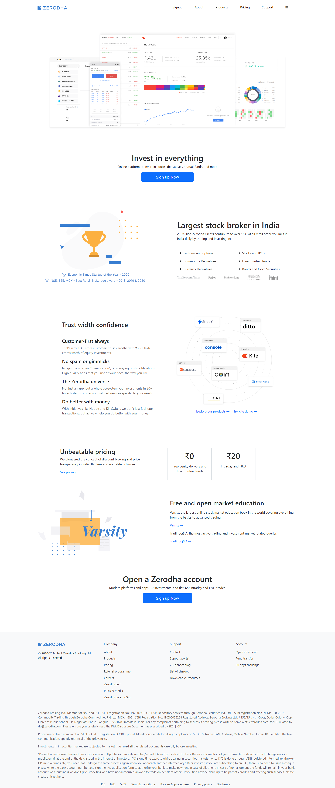
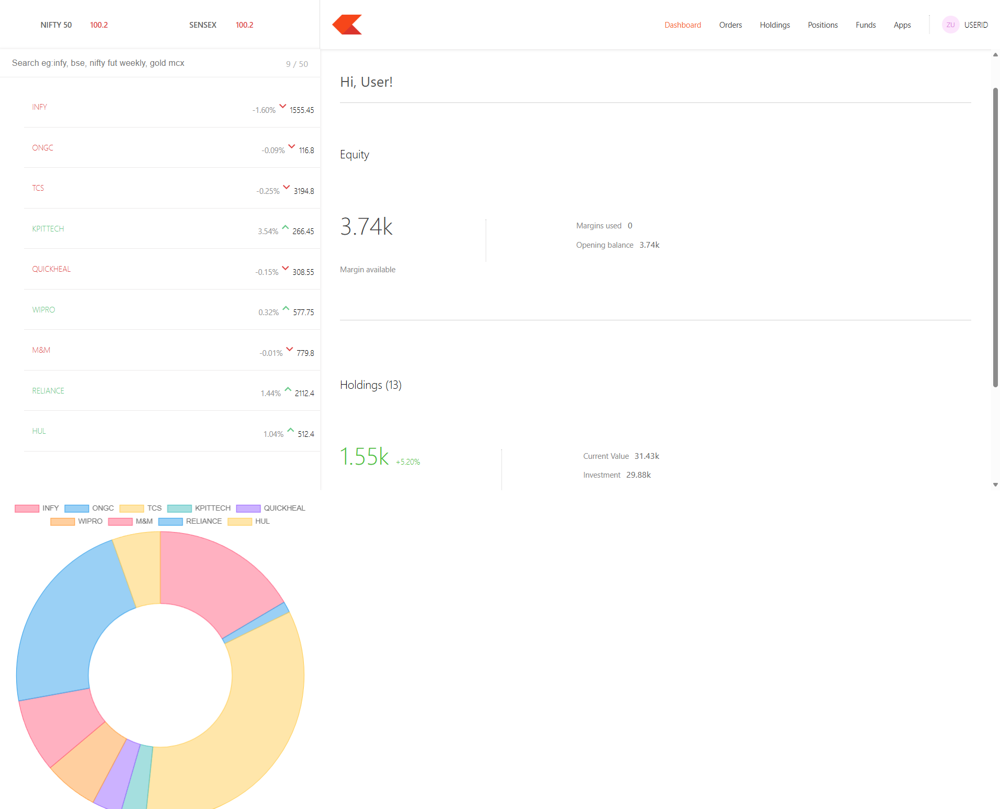
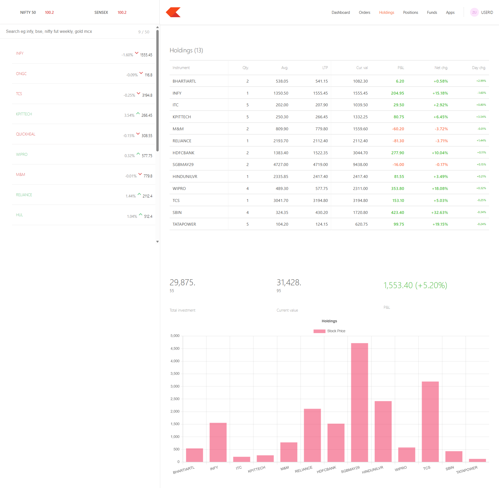

# 💹 Zerodha Clone (MERN Stack)

A high-performance **full-stack clone of the Zerodha trading platform** built using the **MERN Stack (MongoDB, Express.js, React.js, Node.js)**.

This project replicates the core functionality of a modern **stock trading ecosystem** including authentication, trading dashboard, portfolio tracking, and order management while maintaining a **clean UI and scalable backend architecture**.

---

# 🌟 Key Features

### 🔐 User Authentication

Secure login and signup system for users.

### 📊 Trading Dashboard

Interactive dashboard for monitoring stocks and trading activity.

### 💰 Order Management

Buy and sell stock interface similar to the Zerodha platform.

### 📈 Portfolio Tracking

View holdings and investment positions in one place.

### 🧩 Modular Backend Architecture

Clean and scalable backend structure with Controllers, Routes, and Schemas.

### 🔒 Environment Security

Sensitive configuration managed using `.env`.

---

# 🛠 Tech Stack

## Frontend

* React.js (Functional Components & Hooks)
* HTML5
* CSS3
* JavaScript (ES6+)

## Backend

* Node.js
* Express.js

## Database

* MongoDB
* Mongoose

## Tools

* Postman (API Testing)
* Git & GitHub (Version Control)

---

# 📂 Project Structure

```
ZERODHA-CLONE-MERN
│
├── 📁 backend              # Node.js & Express Server
│   ├── 📁 Controllers      # Request handlers (business logic)
│   ├── 📁 Middlewares      # Authentication & security checks
│   ├── 📁 model            # Mongoose models (User, Orders, etc.)
│   ├── 📁 Routes           # API endpoint definitions
│   ├── 📁 schemas          # Data validation schemas
│   ├── 📁 util             # Helper functions / utilities
│   ├── 📄 .env             # Environment variables (private)
│   ├── 📄 index.js         # Backend server entry point
│   └── 📄 package.json     # Backend dependencies
│
├── 📁 dashboard            # React Trading Dashboard
│   ├── 📁 public
│   ├── 📁 src
│   ├── 📄 package.json
│   └── 📄 .gitignore
│
├── 📁 frontend             # React Landing Website
│   ├── 📁 build
│   ├── 📁 src
│   ├── 📄 package.json
│   └── 📄 .gitignore
│
├── 📁 screenshots          # Project UI screenshots
│   ├── landing_page.png
│   ├── dashboard.png
│   └── holdings.png
│
└── 📄 README.md            # Project documentation
```

---

# 🚀 Installation & Setup

Follow the steps below to run the project locally.

## 1️⃣ Clone the Repository

```bash
git clone https://github.com/Suhas-Bharti/zerodha-clone-mern.git
cd zerodha-clone-mern
```

---

## 2️⃣ Backend Setup

```bash
cd backend
npm install
```

Create a `.env` file in the backend folder:

```
MONGO_URI=your_mongodb_connection_string
PORT=3000
```

Start the backend server:

```bash
node index.js
```

---

## 3️⃣ Frontend Setup

```bash
cd ../frontend
npm install
npm start
```

---

## 4️⃣ Dashboard Setup

```bash
cd ../dashboard
npm install
npm start
```

---

# 📈 Future Enhancements

* Real-time stock price updates using WebSockets / Socket.io
* Advanced trading charts using TradingView / Chart.js
* JWT-based authentication
* Cloud deployment (AWS / Render / Vercel)

---

# 📸 Screenshots

### Main Landing Page



### User Dashboard



### User Holdings



---

# 👤 Author

**Suhas Bharti**

GitHub
https://github.com/Suhas-Bharti

---

⭐ If you found this project helpful, consider giving it a **star**.
